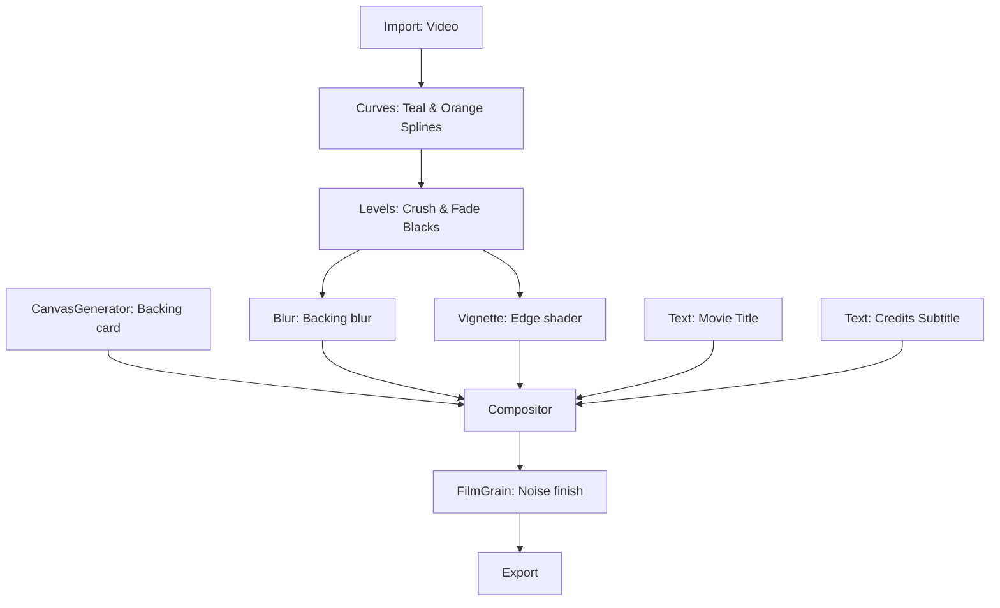

# Recipe: Cinematic Style Transfer & Color Correction

Perform post-production grading and layout adjustments manually using Curves and Levels nodes. This recipe takes an ungraded source video, applies primary S-curve contrast, shifts color balance on RGB channels, crushes shadows with levels, frames it using a blurred duplicate backing, applies a classic vignette, adds chromatic moving film grain, and overlays typographic titles.



> **Fonts:** the `fonts` array registers the TTFs used by the text layout nodes (headless
text rendering requires real font files). Swap the paths for fonts available on your machine,
or drop the array when rendering in the Gatewai editor.

## Canvas Specification (`spec.json`)

```json
{
  "name": "Cinematic Grade & Layout Finishing",

  "fonts": [
    { "family": "Liberation Sans", "file": "/usr/share/fonts/truetype/liberation/LiberationSans-Regular.ttf" },
    { "family": "Liberation Sans Bold", "file": "/usr/share/fonts/truetype/liberation/LiberationSans-Bold.ttf" }
  ],  "nodes": [
    {
      "id": "ungraded-video",
      "type": "Import",
      "name": "Ungraded Footage",
      "config": {
        "file": "./assets/input-flat-footage.mp4"
      }
    },
    {
      "id": "curves-grader",
      "type": "Curves",
      "name": "RGB Spline Grader",
      "config": {
        "curveType": "rgb",
        "master": [
          { "x": 0.0, "y": 0.0 },
          { "x": 0.25, "y": 0.2 },
          { "x": 0.75, "y": 0.8 },
          { "x": 1.0, "y": 1.0 }
        ],
        "red": [
          { "x": 0.0, "y": 0.0 },
          { "x": 0.5, "y": 0.45 },
          { "x": 0.8, "y": 0.85 },
          { "x": 1.0, "y": 1.0 }
        ],
        "blue": [
          { "x": 0.0, "y": 0.0 },
          { "x": 0.2, "y": 0.25 },
          { "x": 0.5, "y": 0.48 },
          { "x": 1.0, "y": 0.95 }
        ]
      }
    },
    {
      "id": "levels-corrector",
      "type": "Levels",
      "name": "Tonal Range Limiter",
      "config": {
        "master": {
          "inBlack": 0.05,
          "inWhite": 0.95,
          "outBlack": 0.02,
          "outWhite": 0.98
        }
      }
    },
    {
      "id": "background-blur",
      "type": "Blur",
      "name": "Ambient Backing Blur",
      "config": {
        "blurType": "Gaussian",
        "strength": 40
      }
    },
    {
      "id": "foreground-vignette",
      "type": "Vignette",
      "name": "Camera Vignette",
      "config": {
        "strength": 65,
        "radius": 1.0,
        "softness": 0.4,
        "roundness": 0.7
      }
    },
    {
      "id": "canvas-backing",
      "type": "CanvasGenerator",
      "name": "Solid Backing Card",
      "config": {
        "width": 1920,
        "height": 1080,
        "fillType": "solid",
        "solidColor": "#0b0b0f"
      }
    },
    {
      "id": "movie-title-text",
      "type": "Text",
      "name": "Movie Title Text",
      "config": {
        "content": "ANTIGRAVITY"
      }
    },
    {
      "id": "movie-credits-text",
      "type": "Text",
      "name": "Credits Text",
      "config": {
        "content": "A DEEPMIND ADVANCED AGENT PRODUCTION"
      }
    },
    {
      "id": "cinematic-compositor",
      "type": "Compositor",
      "name": "Layout Assembler",
      "config": {
        "width": 1920,
        "height": 1080,
        "fps": 24,
        "mode": "Video",
        "layout": [
          {
            "id": "base-card",
            "kind": "media",
            "inputHandleId": "backing_card_handle",
            "position": "absolute",
            "x": 0,
            "y": 0,
            "width": 1920,
            "height": 1080,
            "fit": "cover",
            "zIndex": 0
          },
          {
            "id": "ambient-video",
            "kind": "media",
            "inputHandleId": "blurred_video_handle",
            "position": "absolute",
            "x": 0,
            "y": 0,
            "width": 1920,
            "height": 1080,
            "fit": "cover",
            "opacity": 0.4,
            "zIndex": 1
          },
          {
            "id": "framed-content",
            "kind": "flex",
            "dir": "column",
            "width": 1920,
            "height": 1080,
            "justify": "center",
            "align": "center",
            "zIndex": 2,
            "children": [
              {
                "id": "center-video-box",
                "kind": "box",
                "width": 1400,
                "height": 787,
                "borderRadius": 24,
                "borderWidth": 4,
                "borderColor": "rgba(255, 255, 255, 0.15)",
                "padding": 0,
                "children": [
                  {
                    "id": "graded-vignette-video",
                    "kind": "media",
                    "inputHandleId": "graded_video_handle",
                    "width": 1392,
                    "height": 779,
                    "fit": "cover",
                    "borderRadius": 20
                  }
                ]
              }
            ]
          },
          {
            "id": "titles-overlay",
            "kind": "flex",
            "dir": "column",
            "width": 1920,
            "height": 1080,
            "justify": "space-between",
            "align": "center",
            "padding": 120,
            "zIndex": 3,
            "children": [
              {
                "id": "top-credits-container",
                "kind": "flex",
                "dir": "column",
                "align": "center",
                "children": [
                  {
                    "id": "credit-layer",
                    "kind": "text",
                    "inputHandleId": "credits_text_handle",
                    "fontSize": 20,
                    "fontFamily": "Liberation Sans Bold",
                    "fontWeight": "bold",
                    "letterSpacing": 8,
                    "fill": "#a0a0b0"
                  }
                ]
              },
              {
                "id": "bottom-title-container",
                "kind": "flex",
                "dir": "column",
                "align": "center",
                "animation": {
                  "tracks": [
                    {
                      "id": "title-opacity",
                      "prop": "opacity",
                      "keyframes": [
                        { "id": "t-o0", "frame": 30, "value": 0 },
                        { "id": "t-o1", "frame": 60, "value": 1 }
                      ]
                    }
                  ]
                },
                "children": [
                  {
                    "id": "title-layer",
                    "kind": "text",
                    "inputHandleId": "title_text_handle",
                    "fontSize": 72,
                    "fontFamily": "Liberation Sans Bold",
                    "fontWeight": 900,
                    "letterSpacing": 12,
                    "fill": "#ffffff"
                  }
                ]
              }
            ]
          }
        ]
      },
      "dynamicInputs": [
        { "label": "backing_card_handle", "dataTypes": ["Image"] },
        { "label": "blurred_video_handle", "dataTypes": ["Video"] },
        { "label": "graded_video_handle", "dataTypes": ["Video"] },
        { "label": "title_text_handle", "dataTypes": ["Text"] },
        { "label": "credits_text_handle", "dataTypes": ["Text"] }
      ]
    },
    {
      "id": "grain-adder",
      "type": "FilmGrain",
      "name": "Master Grain Finisher",
      "config": {
        "strength": 18,
        "size": 1.2,
        "monochrome": false,
        "shadows": 0.1,
        "midtones": 1.0,
        "highlights": 0.15
      }
    },
    {
      "id": "cinematic-export",
      "type": "Export",
      "name": "Export Movie",
      "config": {
        "file": "./renders/cinematic-graded-film.mp4",
        "format": "mp4"
      }
    }
  ],
  "edges": [
    { "source": "ungraded-video", "target": "curves-grader", "sourceLabel": "Result", "targetLabel": "Input" },
    { "source": "curves-grader", "target": "levels-corrector", "sourceLabel": "Result", "targetLabel": "Input" },
    
    { "source": "levels-corrector", "target": "background-blur", "sourceLabel": "Result", "targetLabel": "Input" },
    { "source": "levels-corrector", "target": "foreground-vignette", "sourceLabel": "Result", "targetLabel": "Input" },
    
    { "source": "canvas-backing", "target": "cinematic-compositor", "sourceLabel": "Result", "targetLabel": "backing_card_handle" },
    { "source": "background-blur", "target": "cinematic-compositor", "sourceLabel": "Result", "targetLabel": "blurred_video_handle" },
    { "source": "foreground-vignette", "target": "cinematic-compositor", "sourceLabel": "Result", "targetLabel": "graded_video_handle" },
    { "source": "movie-title-text", "target": "cinematic-compositor", "sourceLabel": "Result", "targetLabel": "title_text_handle" },
    { "source": "movie-credits-text", "target": "cinematic-compositor", "sourceLabel": "Result", "targetLabel": "credits_text_handle" },
    
    { "source": "cinematic-compositor", "target": "grain-adder", "sourceLabel": "Result", "targetLabel": "Input" },
    { "source": "grain-adder", "target": "cinematic-export", "sourceLabel": "Result", "targetLabel": "Input" }
  ]
}
```
