# Recipe: Product Demo Video with Video-to-Music Scoring

Program an automated product showcase video scored with an AI-generated soundtrack matching the video style. This recipe imports flat product footage, applies teal-and-orange grading curves, adds an ambient vignette, and composites it onto a gradient background canvas using the **Compositor node's keyframe animation system**: a slow "breathing" zoom on the backdrop, a scale-and-fade entrance for the product shot, and a staggered drop-in / rise-in for the title and feature-callout badge. It then analyzes the visual cut to generate a synchronized soundtrack using VideoToMusic, applies audio fades, and remuxes video + audio through a second, fade-in Compositor pass before export.

```mermaid
graph TD
    IV[Import: Product Video] --> C1[Curves: Teal & Orange Splines]
    C1 --> V1[Vignette: Ambient border]
    
    CG[CanvasGenerator: Backing card] --> COMP1[Primary Compositor<br/>animated entrances]
    V1 --> COMP1
    T1[Text: Brand Header] --> COMP1
    T2[Text: Feature Callout] --> COMP1
    
    COMP1 --> VTM[VideoToMusic: Score video]
    T3[Text: Music Style Prompt] --> VTM
    
    VTM --> AF[AudioFade: Fade finisher]
    
    COMP1 --> COMP2[Final Compositor<br/>fade-in polish]
    AF --> COMP2
    
    COMP2 --> EXP[Export: Scored Video]
    
    style C1 fill:#1f3d5a,stroke:#38b2ac,stroke-width:2px
    style COMP1 fill:#2a563b,stroke:#00ff9d,stroke-width:3px
    style VTM fill:#5c3b5c,stroke:#b886b8,stroke-width:2px
    style COMP2 fill:#2a563b,stroke:#00ff9d,stroke-width:3px
```



## Animation Notes

All keyframe `frame` numbers assume `fps: 24` (set on both Compositor nodes) — scale them proportionally if you change `fps`.

**Primary Compositor (`video-compositor`)**
- `bg-layer` — continuous "breathing" zoom: `scale` 1.0 → 1.06, `sine`/`inOut`, `yoyo: true`, `repeat: -1`. Keeps the backdrop alive for the whole clip instead of sitting static.
- `product-video-layer` — entrance only: `scale` 0.92 → 1.0 (`back`/`out`) and `opacity` 0 → 1 (`power2`/`out`) over the first ~18 frames, so the product shot pops into frame rather than hard-cutting in.
- `title-layer` — `opacity` fade plus a `y` drop-in from -24 → 0 (`back`/`out`).
- `callout-badge` — the feature callout is now a pill-shaped `box` (background, `borderRadius: 999`) wrapping the subtitle text, staggered ~6 frames after the title: `y` rise-in 40 → 0 and `opacity` fade, mirroring the compositor skill's own "badges-rise" pattern.
- **Structural fix:** the old layout nested both text nodes inside one shared child of a `justify: "space-between"` column, so the space-between had nothing to distribute. `title-layer` and `callout-badge` are now direct siblings of `text-flex-container`, so they land at the true top and bottom of frame and the stagger actually reads top-to-bottom.

**Final Compositor (`final-compositor`)**
- `composed-video-layer` — quick `opacity` fade-in (0 → 1 over 10 frames, `power1`/`out`) against a `#000000` `backgroundColor`, so the export opens from black instead of starting abruptly. Fade-out is intentionally omitted since this node doesn't know the rendered clip's total frame length.

> **Fonts:** the `fonts` array registers the TTFs used by the text layout nodes (headless
text rendering requires real font files). Swap the paths for fonts available on your machine,
or drop the array when rendering in the Gatewai editor.

## Canvas Specification (`spec.json`)

```json
{
  "name": "Product Demo with Video-to-Music Scoring",

  "fonts": [
    { "family": "Liberation Sans", "file": "/usr/share/fonts/truetype/liberation/LiberationSans-Regular.ttf" },
    { "family": "Liberation Sans Bold", "file": "/usr/share/fonts/truetype/liberation/LiberationSans-Bold.ttf" }
  ],  "nodes": [
    {
      "id": "raw-product-video",
      "type": "Import",
      "name": "Raw Product Footage",
      "config": {
        "file": "./assets/raw-product-demo.mp4"
      }
    },
    {
      "id": "curves-grader",
      "type": "Curves",
      "name": "Teal & Orange Splines",
      "config": {
        "curveType": "rgb",
        "master": [
          { "x": 0.0, "y": 0.0 },
          { "x": 0.25, "y": 0.2 },
          { "x": 0.75, "y": 0.8 },
          { "x": 1.0, "y": 1.0 }
        ],
        "red": [
          { "x": 0.0, "y": 0.0 },
          { "x": 0.5, "y": 0.45 },
          { "x": 0.8, "y": 0.85 },
          { "x": 1.0, "y": 1.0 }
        ],
        "blue": [
          { "x": 0.0, "y": 0.0 },
          { "x": 0.2, "y": 0.25 },
          { "x": 0.5, "y": 0.48 },
          { "x": 1.0, "y": 0.95 }
        ]
      }
    },
    {
      "id": "vignette-filter",
      "type": "Vignette",
      "name": "Vignette Border",
      "config": {
        "strength": 50,
        "radius": 1.1,
        "softness": 0.4,
        "roundness": 0.6,
        "centerX": 0.5,
        "centerY": 0.5
      }
    },
    {
      "id": "canvas-bg",
      "type": "CanvasGenerator",
      "name": "Linear Gradient Canvas",
      "config": {
        "width": 1920,
        "height": 1080,
        "fillType": "linear",
        "gradientStart": "#1a0f30",
        "gradientEnd": "#0a0614",
        "gradientAngle": 135
      }
    },
    {
      "id": "brand-title",
      "type": "Text",
      "name": "Brand Header",
      "config": {
        "content": "QUANTUM SLEEK"
      }
    },
    {
      "id": "brand-sub",
      "type": "Text",
      "name": "Feature Callout",
      "config": {
        "content": "NEXT-GEN PERFORMANCE"
      }
    },
    {
      "id": "video-compositor",
      "type": "Compositor",
      "name": "Primary Layout Assembler — Animated",
      "config": {
        "width": 1920,
        "height": 1080,
        "fps": 24,
        "mode": "Video",
        "layout": [
          {
            "id": "bg-layer",
            "kind": "media",
            "inputHandleId": "bg_canvas_handle",
            "position": "absolute",
            "x": 0,
            "y": 0,
            "width": 1920,
            "height": 1080,
            "fit": "cover",
            "zIndex": 0,
            "anchorX": 0.5,
            "anchorY": 0.5,
            "animation": {
              "tracks": [
                {
                  "id": "bg-breathe-scale",
                  "prop": "scale",
                  "keyframes": [
                    { "id": "bg-breathe-k0", "frame": 0, "value": 1.0 },
                    { "id": "bg-breathe-k1", "frame": 180, "value": 1.06, "ease": { "name": "sine", "dir": "inOut" } }
                  ],
                  "repeat": -1,
                  "yoyo": true
                }
              ]
            }
          },
          {
            "id": "product-video-layer",
            "kind": "media",
            "inputHandleId": "video_handle",
            "position": "absolute",
            "x": 260,
            "y": 140,
            "width": 1400,
            "height": 800,
            "fit": "cover",
            "borderRadius": 24,
            "zIndex": 1,
            "anchorX": 0.5,
            "anchorY": 0.5,
            "animation": {
              "tracks": [
                {
                  "id": "product-entrance-scale",
                  "prop": "scale",
                  "keyframes": [
                    { "id": "product-scale-k0", "frame": 0, "value": 0.92 },
                    { "id": "product-scale-k1", "frame": 18, "value": 1.0, "ease": { "name": "back", "dir": "out", "params": [1.4] } }
                  ]
                },
                {
                  "id": "product-entrance-fade",
                  "prop": "opacity",
                  "keyframes": [
                    { "id": "product-fade-k0", "frame": 0, "value": 0 },
                    { "id": "product-fade-k1", "frame": 14, "value": 1, "ease": { "name": "power2", "dir": "out" } }
                  ]
                }
              ]
            }
          },
          {
            "id": "text-flex-container",
            "kind": "flex",
            "dir": "column",
            "width": 1920,
            "height": 1080,
            "justify": "space-between",
            "align": "center",
            "padding": 60,
            "zIndex": 2,
            "children": [
              {
                "id": "title-layer",
                "kind": "text",
                "inputHandleId": "title_text_handle",
                "fontSize": 56,
                "fontFamily": "Liberation Sans Bold",
                "fontWeight": 900,
                "letterSpacing": 8,
                "fill": "#ffffff",
                "animation": {
                  "tracks": [
                    {
                      "id": "title-fade",
                      "prop": "opacity",
                      "keyframes": [
                        { "id": "title-fade-k0", "frame": 0, "value": 0 },
                        { "id": "title-fade-k1", "frame": 16, "value": 1, "ease": { "name": "power2", "dir": "out" } }
                      ]
                    },
                    {
                      "id": "title-drop",
                      "prop": "y",
                      "keyframes": [
                        { "id": "title-drop-k0", "frame": 0, "value": -24 },
                        { "id": "title-drop-k1", "frame": 20, "value": 0, "ease": { "name": "back", "dir": "out", "params": [1.6] } }
                      ]
                    }
                  ]
                }
              },
              {
                "id": "callout-badge",
                "kind": "box",
                "width": "fit",
                "background": "rgba(20, 10, 35, 0.55)",
                "borderRadius": 999,
                "padding": 20,
                "animation": {
                  "tracks": [
                    {
                      "id": "badge-rise",
                      "prop": "y",
                      "keyframes": [
                        { "id": "badge-rise-k0", "frame": 6, "value": 40 },
                        { "id": "badge-rise-k1", "frame": 26, "value": 0, "ease": { "name": "back", "dir": "out", "params": [1.7] } }
                      ]
                    },
                    {
                      "id": "badge-fade",
                      "prop": "opacity",
                      "keyframes": [
                        { "id": "badge-fade-k0", "frame": 6, "value": 0 },
                        { "id": "badge-fade-k1", "frame": 22, "value": 1, "ease": { "name": "power2", "dir": "out" } }
                      ]
                    }
                  ]
                },
                "children": [
                  {
                    "id": "subtitle-layer",
                    "kind": "text",
                    "inputHandleId": "subtitle_text_handle",
                    "fontSize": 22,
                    "fontFamily": "Liberation Sans Bold",
                    "fontWeight": 700,
                    "letterSpacing": 4,
                    "fill": "#c5a3ff"
                  }
                ]
              }
            ]
          }
        ]
      },
      "dynamicInputs": [
        { "label": "bg_canvas_handle", "dataTypes": ["Image"] },
        { "label": "video_handle", "dataTypes": ["Video"] },
        { "label": "title_text_handle", "dataTypes": ["Text"] },
        { "label": "subtitle_text_handle", "dataTypes": ["Text"] }
      ]
    },
    {
      "id": "music-style-prompt",
      "type": "Text",
      "name": "Soundtrack Prompt",
      "config": {
        "content": "cyberpunk synthwave, energetic beat, futuristic product reveal, 120 bpm"
      }
    },
    {
      "id": "video-scorer",
      "type": "VideoToMusic",
      "name": "Video to Music Scorer",
      "config": {}
    },
    {
      "id": "audio-fader",
      "type": "AudioFade",
      "name": "Soundtrack Fader",
      "config": {
        "fadeInMs": 500,
        "fadeOutMs": 1500
      }
    },
    {
      "id": "final-compositor",
      "type": "Compositor",
      "name": "Final Audio-Video Multiplexer — Fade-In",
      "config": {
        "width": 1920,
        "height": 1080,
        "fps": 24,
        "mode": "Video",
        "backgroundColor": "#000000",
        "layout": [
          {
            "id": "composed-video-layer",
            "kind": "media",
            "inputHandleId": "video_final_handle",
            "position": "absolute",
            "x": 0,
            "y": 0,
            "width": 1920,
            "height": 1080,
            "fit": "cover",
            "zIndex": 0,
            "animation": {
              "tracks": [
                {
                  "id": "final-fade-in",
                  "prop": "opacity",
                  "keyframes": [
                    { "id": "final-fade-k0", "frame": 0, "value": 0 },
                    { "id": "final-fade-k1", "frame": 10, "value": 1, "ease": { "name": "power1", "dir": "out" } }
                  ]
                }
              ]
            }
          },
          {
            "id": "soundtrack-audio-layer",
            "kind": "media",
            "inputHandleId": "audio_final_handle",
            "volume": 1,
            "zIndex": 1
          }
        ]
      },
      "dynamicInputs": [
        { "label": "video_final_handle", "dataTypes": ["Video"] },
        { "label": "audio_final_handle", "dataTypes": ["Audio"] }
      ]
    },
    {
      "id": "final-export",
      "type": "Export",
      "name": "Export Scored Video",
      "config": {
        "file": "./renders/product-demo-scored.mp4",
        "format": "mp4"
      }
    }
  ],
  "edges": [
    { "source": "raw-product-video", "target": "curves-grader", "sourceLabel": "Result", "targetLabel": "Input" },
    { "source": "curves-grader", "target": "vignette-filter", "sourceLabel": "Result", "targetLabel": "Input" },
    
    { "source": "canvas-bg", "target": "video-compositor", "sourceLabel": "Result", "targetLabel": "bg_canvas_handle" },
    { "source": "vignette-filter", "target": "video-compositor", "sourceLabel": "Result", "targetLabel": "video_handle" },
    { "source": "brand-title", "target": "video-compositor", "sourceLabel": "Result", "targetLabel": "title_text_handle" },
    { "source": "brand-sub", "target": "video-compositor", "sourceLabel": "Result", "targetLabel": "subtitle_text_handle" },
    
    { "source": "video-compositor", "target": "video-scorer", "sourceLabel": "Result", "targetLabel": "Video" },
    { "source": "music-style-prompt", "target": "video-scorer", "sourceLabel": "Result", "targetLabel": "Prompt" },
    
    { "source": "video-scorer", "target": "audio-fader", "sourceLabel": "Result", "targetLabel": "Input" },
    
    { "source": "video-compositor", "target": "final-compositor", "sourceLabel": "Result", "targetLabel": "video_final_handle" },
    { "source": "audio-fader", "target": "final-compositor", "sourceLabel": "Result", "targetLabel": "audio_final_handle" },
    
    { "source": "final-compositor", "target": "final-export", "sourceLabel": "Result", "targetLabel": "Input" }
  ]
}
```