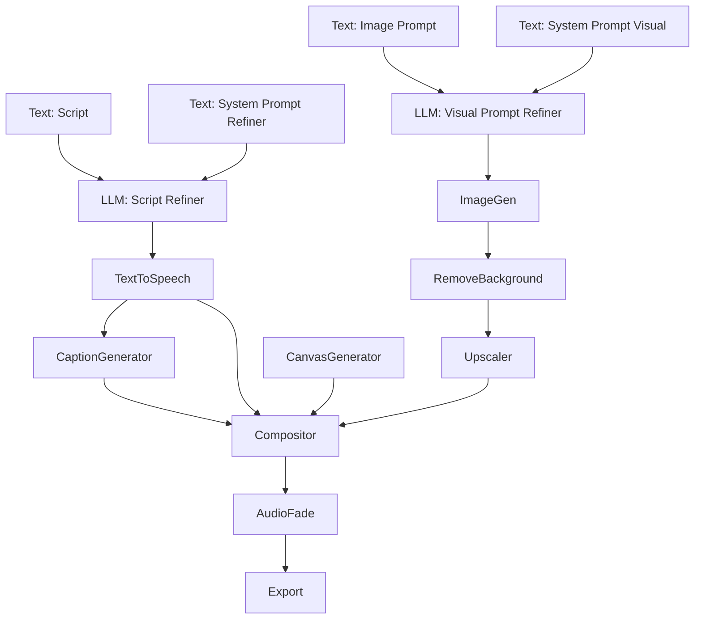

# Recipe: Viral AI Social Short

Generate a fully produced social media short from a single raw text script. This recipe refines the script via LLM, synthesizes human-like voiceover, auto-transcribes captions using Whisper AI, generates a character avatar using Flux, isolates and upscales the character, composites them on an animated gradient background, and burns the text captions over the video in real-time.



> **Fonts:** the `fonts` array registers the TTFs used by the text layout nodes (headless
text rendering requires real font files). Swap the paths for fonts available on your machine,
or drop the array when rendering in the Gatewai editor.

## Canvas Specification (`spec.json`)

```json
{
  "name": "Viral AI Social Short",

  "fonts": [
    { "family": "Liberation Sans", "file": "/usr/share/fonts/truetype/liberation/LiberationSans-Regular.ttf" },
    { "family": "Liberation Sans Bold", "file": "/usr/share/fonts/truetype/liberation/LiberationSans-Bold.ttf" }
  ],  "nodes": [
    {
      "id": "raw-script-text",
      "type": "Text",
      "name": "Raw Script",
      "config": {
        "content": "Why is the universe antigravity? Here is the absolute truth about cosmic expansion."
      }
    },
    {
      "id": "refiner-system-prompt",
      "type": "Text",
      "name": "Refiner System Instructions",
      "config": {
        "content": "Rewrite this script to be an engaging 10-second TikTok voiceover. Use short, punchy sentences. Return ONLY the script text."
      }
    },
    {
      "id": "script-refiner",
      "type": "LLM",
      "name": "Script Refiner",
      "config": {
        "model": "google/gemini-3.7-flash"
      }
    },
    {
      "id": "tts-generator",
      "type": "TextToSpeech",
      "name": "Voiceover Synthesizer",
      "config": {
        "provider": "gemini",
        "voice": "Zephyr",
        "languageCode": "English (US)",
        "temperature": 0.8
      }
    },
    {
      "id": "whisper-transcriber",
      "type": "CaptionGenerator",
      "name": "Whisper Subtitler",
      "config": {
        "model": "fal-ai/whisper",
        "language": "en",
        "chunk_level": "word"
      }
    },
    {
      "id": "avatar-prompt-text",
      "type": "Text",
      "name": "Avatar Visual Prompt",
      "config": {
        "content": "A high-fidelity portrait of a futuristic cosmic explorer astronaut, cybernetic glowing details, cinematic cyberpunk art style."
      }
    },
    {
      "id": "avatar-system-prompt",
      "type": "Text",
      "name": "Visual System Instructions",
      "config": {
        "content": "Expand this image prompt to add details of lighting, atmospheric fog, high resolution, and contrast. Keep it under 2 sentences."
      }
    },
    {
      "id": "avatar-prompt-refiner",
      "type": "LLM",
      "name": "Visual Prompt Refiner",
      "config": {
        "model": "google/gemini-3.7-flash"
      }
    },
    {
      "id": "avatar-generator",
      "type": "ImageGen",
      "name": "Flux Character Generator",
      "config": {
        "model": "fal-ai/flux-2-pro",
        "falFluxSize": "portrait_16_9"
      }
    },
    {
      "id": "bg-remover",
      "type": "RemoveBackground",
      "name": "Background Remover",
      "config": {}
    },
    {
      "id": "avatar-upscaler",
      "type": "Upscaler",
      "name": "AI Enhancer",
      "config": {
        "upscaleFactor": 2
      }
    },
    {
      "id": "gradient-background",
      "type": "CanvasGenerator",
      "name": "Background Gradient",
      "config": {
        "width": 1080,
        "height": 1920,
        "fillType": "linear",
        "gradientStart": "#0c0a0f",
        "gradientEnd": "#1d152c",
        "gradientAngle": 45
      }
    },
    {
      "id": "main-compositor",
      "type": "Compositor",
      "name": "Video Master Compositor",
      "config": {
        "width": 1080,
        "height": 1920,
        "fps": 30,
        "mode": "Video",
        "layout": [
          {
            "id": "bg-layer",
            "kind": "media",
            "inputHandleId": "bg_gradient_handle",
            "position": "absolute",
            "x": 0,
            "y": 0,
            "width": 1080,
            "height": 1920,
            "fit": "cover",
            "zIndex": 0
          },
          {
            "id": "voiceover-audio",
            "kind": "media",
            "inputHandleId": "audio_handle",
            "zIndex": 1
          },
          {
            "id": "hud-overlay",
            "kind": "flex",
            "dir": "column",
            "width": 1080,
            "height": 1920,
            "justify": "space-between",
            "align": "center",
            "padding": 80,
            "zIndex": 2,
            "children": [
              {
                "id": "header-card",
                "kind": "box",
                "width": "fill",
                "padding": 24,
                "borderRadius": 24,
                "background": "rgba(18, 16, 24, 0.8)",
                "animation": {
                  "tracks": [
                    {
                      "id": "header-y",
                      "prop": "y",
                      "keyframes": [
                        { "id": "h-y0", "frame": 0, "value": -200 },
                        { "id": "h-y1", "frame": 30, "value": 0, "ease": { "name": "back", "dir": "out" } }
                      ]
                    }
                  ]
                },
                "children": [
                  {
                    "id": "header-flex",
                    "kind": "flex",
                    "dir": "column",
                    "width": "fill",
                    "align": "center",
                    "children": [
                      {
                        "id": "title-text",
                        "kind": "text",
                        "text": "COSMIC INTELLIGENCE",
                        "fontSize": 42,
                        "fontWeight": 900,
                        "fontFamily": "Liberation Sans Bold",
                        "fill": "#ff00a0",
                        "align": "center"
                      }
                    ]
                  }
                ]
              },
              {
                "id": "character-box",
                "kind": "box",
                "width": 800,
                "height": 800,
                "borderRadius": 400,
                "background": "rgba(255, 255, 255, 0.05)",
                "animation": {
                  "tracks": [
                    {
                      "id": "char-scale",
                      "prop": "scale",
                      "keyframes": [
                        { "id": "c-s0", "frame": 20, "value": 0 },
                        { "id": "c-s1", "frame": 50, "value": 1, "ease": { "name": "elastic", "dir": "out", "params": [1.0, 0.5] } }
                      ]
                    }
                  ]
                },
                "children": [
                  {
                    "id": "character-avatar",
                    "kind": "media",
                    "inputHandleId": "avatar_handle",
                    "width": 800,
                    "height": 800,
                    "fit": "cover",
                    "borderRadius": 400
                  }
                ]
              },
              {
                "id": "caption-container",
                "kind": "box",
                "width": "fill",
                "padding": 30,
                "borderRadius": 16,
                "background": "rgba(0, 0, 0, 0.75)",
                "children": [
                  {
                    "id": "caption-media",
                    "kind": "media",
                    "inputHandleId": "subtitle_handle",
                    "width": "fill",
                    "height": 200,
                    "fit": "contain"
                  }
                ]
              }
            ]
          }
        ]
      },
      "dynamicInputs": [
        { "label": "bg_gradient_handle", "dataTypes": ["Image"] },
        { "label": "avatar_handle", "dataTypes": ["Image"] },
        { "label": "subtitle_handle", "dataTypes": ["Caption"] },
        { "label": "audio_handle", "dataTypes": ["Audio"] }
      ]
    },
    {
      "id": "audio-fader",
      "type": "AudioFade",
      "name": "Audio Finishing",
      "config": {
        "fadeInMs": 500,
        "fadeOutMs": 1000
      }
    },
    {
      "id": "final-export",
      "type": "Export",
      "name": "Export Video",
      "config": {
        "file": "./renders/social-short-viral.mp4",
        "format": "mp4",
        "renderAt": "browser"
      }
    }
  ],
  "edges": [
    { "source": "raw-script-text", "target": "script-refiner", "sourceLabel": "Result", "targetLabel": "Prompt" },
    { "source": "refiner-system-prompt", "target": "script-refiner", "sourceLabel": "Result", "targetLabel": "System Prompt" },
    { "source": "script-refiner", "target": "tts-generator", "sourceLabel": "Result", "targetLabel": "Prompt" },
    { "source": "tts-generator", "target": "whisper-transcriber", "sourceLabel": "Result", "targetLabel": "Input" },
    
    { "source": "avatar-prompt-text", "target": "avatar-prompt-refiner", "sourceLabel": "Result", "targetLabel": "Prompt" },
    { "source": "avatar-system-prompt", "target": "avatar-prompt-refiner", "sourceLabel": "Result", "targetLabel": "System Prompt" },
    { "source": "avatar-prompt-refiner", "target": "avatar-generator", "sourceLabel": "Result", "targetLabel": "Prompt" },
    { "source": "avatar-generator", "target": "bg-remover", "sourceLabel": "Result", "targetLabel": "Media" },
    { "source": "bg-remover", "target": "avatar-upscaler", "sourceLabel": "Result", "targetLabel": "Input" },
    
    { "source": "gradient-background", "target": "main-compositor", "sourceLabel": "Result", "targetLabel": "bg_gradient_handle" },
    { "source": "avatar-upscaler", "target": "main-compositor", "sourceLabel": "Result", "targetLabel": "avatar_handle" },
    { "source": "whisper-transcriber", "target": "main-compositor", "sourceLabel": "Result", "targetLabel": "subtitle_handle" },
    { "source": "tts-generator", "target": "main-compositor", "sourceLabel": "Result", "targetLabel": "audio_handle" },
    
    { "source": "main-compositor", "target": "audio-fader", "sourceLabel": "Result", "targetLabel": "Input" },
    { "source": "audio-fader", "target": "final-export", "sourceLabel": "Result", "targetLabel": "Input" }
  ]
}
```
